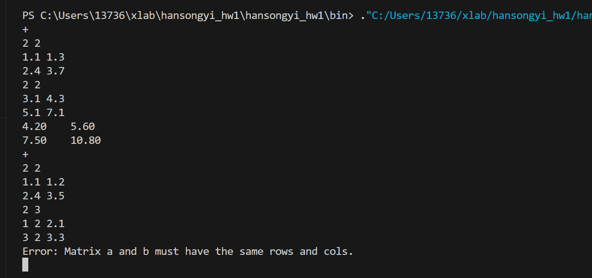

# add_Matrix
遍历每一个位置然后相加

# sub_Matrix
遍历每一个位置然后相减
# mul_Matrix
按照矩阵乘法的定义进行运算
# scale_Matrix
遍历每一个位置然后乘上系数
# transpose_Matrix
c.data[j][i]=a.data[i][j]即可
# trace_Matrix
遍历对角线上的元素相加即可
# det_Matrix
利用Lplace定理将行列式按照第一列进行展开，然后利用递归，计算出行列式
# rank_Matrix
采用高斯消元法：
从第一列开始，先保证第一列第一行的元素不为0 ，通过swapRows()函数进行两行交换。通过Elimination()将主元下方的元素都消成0，然后rank++.每次rank++之后，利用checkZeroRowBlow()判断当前位置下方所有元素是否全为0.
# inv_Matrix
利用
$$
A^{-1}=\dfrac{1}{|A|}A^*
$$
计算出逆矩阵
